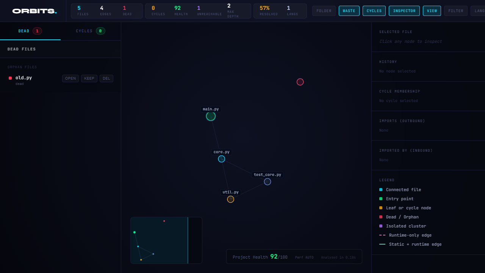

# Orbits

Orbits is a map for codebases: it shows the main routes through a repo, what actually ran, what changed, and what looks safe to clean up.

It analyzes a source tree, resolves project-local dependencies, merges optional runtime traces, scores dead-code confidence with git/runtime evidence, writes a `graph.json`, and serves a bundled visualizer for exploring the result.

The current stack is:

- Python backend analyzer
- D3 + canvas visualizer
- browser-side worker analysis for folder loading in supported browsers
- local HTTP serving through `orbits scan . --open`
- first-class HTML/CSS/static-asset graph extraction for web projects
- optional Python and Node.js runtime tracing with merged dynamic-edge overlays
- codebase-map intelligence for regions, entrypoints, core hubs, impact, framework signals, and runtime command discovery
- Phase 6 language coverage with deep/partial/unknown confidence per file, named partial support, production glue files, and unknown-file mapping

## Quick Start

From the repo root:

1. Create and activate a local venv.
2. Install frontend dependencies once.
3. Run the analyzer with `scan . --open`.

### Windows PowerShell

```powershell
python -m venv .venv
.\.venv\Scripts\Activate.ps1
npm install
python analyzer.py scan . --open
```

Then open the URL printed by the server, typically:

```text
http://127.0.0.1:8765/visualizer.html
```

### If You Only Want a Graph File

```powershell
python analyzer.py scan .
```

That writes `graph.json` in the repo root by default.

### If You Already Have a Venv

```powershell
.\.venv\Scripts\python.exe analyzer.py scan . --open
```

## Installable CLI

Orbits can be installed as a normal Python CLI:

```powershell
python -m pip install -e .
orbits scan . -o graph.json
orbits scan . --open
orbits cleanup-plan .
orbits scale-proof .
orbits language-coverage .
orbits --diff C:/temp/old-graph.json C:/temp/new-graph.json
python -m orbits scan . --open
```

The console script maps to the existing `analyzer:main` entry point, and the packaged wheel includes the visualizer assets used by `--open`. The legacy `orbits . --serve` / `python analyzer.py . --serve` forms still work.

For npm-based toolchains, Orbits also has a scoped wrapper that installs the PyPI package and exposes the same CLI:

```powershell
npm install -g @yumekaz/orbits
orbits scan . --open
```

## What It Does

- Crawls a project tree while skipping common noise
- Extracts imports/includes for multiple languages
- Extracts HTML links/scripts/forms/media references and CSS `@import` / `url(...)` assets
- Resolves project-local dependencies
- Computes cycles, islands, orphans, depth, health, and summary stats
- Detects common project entrypoints so launch files are not reported as dead just because nothing imports them
- Adds a higher-level codebase map with regions, core hubs, isolated areas, framework signals, runtime command suggestions, and per-file impact metrics
- Adds per-file language coverage confidence so unsupported files remain visible instead of disappearing from the map
- Scores dead-code confidence from structure, git age/churn, and runtime touch evidence
- Produces PR-friendly architecture diffs, including coupling, cycle, dead-file, classification, confidence, health, and runtime-edge changes
- Writes cleanup plans and scale-proof reports for CI, demos, and review
- Serves an interactive visualizer for the generated graph

## Product Commands

```powershell
orbits scan . --open
orbits cleanup-plan . --cleanup-plan-md cleanup-plan.md
orbits scale-proof . --scale-proof-md scale-proof.md
orbits language-coverage . --language-coverage-md language-coverage.md
orbits --diff old-graph.json new-graph.json --diff-json
```

`scan` writes the graph and opens the guided map UI. `cleanup-plan` groups dead-code candidates into safe, risky, and manual-review buckets with evidence. `scale-proof` summarizes repo size, language mix, edge counts, largest files, and scan metadata. `language-coverage` reports how much of the repo is deep, partial, or unknown analysis.

## Entrypoint Detection

Orbits marks detected launch files as `ENTRY` even when they have no outbound imports. Detection currently uses `package.json` fields/scripts, Python project script metadata, `setup.cfg` / `setup.py` console scripts, Dockerfile `CMD` / `ENTRYPOINT` hints, common Makefile run targets, and conventional names such as `main.py`, `app.py`, `server.py`, `manage.py`, `index.js` / `index.ts`, and Go `main.go`.

Detected entries are stored in `meta.entrypoints`, and each matching node gets `entrypoint: true` plus `entrypoint_reasons` for future UI/report use.

## Supported Languages

First-class extraction and resolution:

- Python
- JavaScript / TypeScript / TSX
- Go
- C / C++
- Java
- Kotlin
- HTML
- CSS / SCSS / Sass / Less
- referenced static assets such as images, fonts, JSON, PDFs, media, and Wasm

Named partial extraction and mapping:

- Rust
- C#
- PHP
- Ruby
- JSON
- YAML
- TOML
- Dockerfile
- Docker Compose
- Makefile
- Shell scripts
- SQL
- GitHub Actions workflows

Fallback:

- Unknown-language files remain visible in the map with `analysis_confidence: "unknown"`
- Generic regex-based extraction is used where a safe import-like pattern is available

Every node includes:

- `analysis_confidence`: `deep`, `partial`, or `unknown`
- `language_role`: source, config, build, ci, script, data, asset, or unknown
- `analysis_note`: the honest reason for that confidence level

The graph metadata includes `meta.language_coverage`, including file counts and percentages for deep, partial, and unknown coverage.

## Pipeline

1. Crawl the project tree.
2. Extract raw import/include statements.
3. Resolve local edges against project files and referenced web assets.
4. Build graph metadata and summary metrics.
5. Optionally trace a Python or Node.js entrypoint at runtime and write `runtime_trace.json`.
6. Merge dynamic runtime edges into the served/exported graph overlay.
7. Attach codebase-map intelligence for the UI and reports.
8. Write `graph.json`.
9. Optionally serve the visualizer and graph assets.

## Current Frontend Architecture

The active visualizer is not Cytoscape.

It currently uses:

- D3 for zoom, motion, and interaction
- `canvas` for graph rendering
- DOM panels for controls, codebase map, impact, inspector, waste, cycles, and search
- `visualizer_worker.js` for browser-side folder analysis

This preserves the older `3.5f` visual feel while keeping the later browser-side workflow and performance work.

## Phase 4 Status

Implemented in the current UI:

- Cluster view
- Filter panel
- File sidebar / inspector
- Waste panel
- Cycles panel
- Search with dependency-tree highlighting
- Minimap
- Language multi-select
- Unsupported-language warning banner
- Folder loading via File System Access API in Chromium-based browsers
- Browser-side worker analysis
- Large-graph performance modes and auto-degradation

Not implemented as originally claimed in older docs:

- Cytoscape.js / react-force-graph as the active renderer

### Visual Baselines

Stage 2 visual regression is opt-in and does not run in the default `test:e2e` path.

Generate or refresh baselines:

```powershell
npm run test:e2e:visual:update
```

Compare against existing baselines:

```powershell
npm run test:e2e:visual
```

Baseline screenshots live in `e2e/visual.spec.ts-snapshots/` and are committed once approved.
The dedicated Playwright screenshot script at `scripts/visual-baselines.mjs` keeps visual regression opt-in and out of the default `test:e2e` run.

## Phase 5 Status

Implemented now:

- Python runtime tracing in a separate subprocess
- Node.js runtime tracing in a separate subprocess
- scoped C / C++ runtime tracing for local native binaries and libraries
- separate `runtime_trace.json` artifact
- merged runtime edge overlay in `graph.json` via `dynamic_edges`
- multi-session runtime metadata via `meta.runtime.sessions[]`
- runtime-aware `view` menu edge modes: `static`, `runtime`, `combined`
- runtime edge styling in the D3 + canvas visualizer
- stale runtime overlay preservation across static reanalysis paths

Current scope and honest boundary:

- runtime tracing is shipped for Python, Node.js, and scoped C / C++ overlays today
- multiple runtime artifacts can be merged into one graph as separate runtime sessions
- static graph metrics like cycles, depth, waste, and health remain static-analysis-based
- runtime edges are an overlay, not a replacement for the static graph
- reanalysis preserves prior runtime overlay, but marks it stale after source-changing actions until you retrace
- Node traces are best for `.js` / `.cjs` / `.mjs` entrypoints; direct TypeScript runtime execution is still not claimed
- runtime-to-static remapping for transpiled `dist/*.js` to `src/*.ts` now uses source maps, inline maps, custom `sourceMappingURL` files, indexed source-map sections, source roots, and common bundler path forms when available, but is still not compiler-perfect
- C / C++ tracing is still intentionally scoped: Linux captures loader edges plus local symbol bindings, macOS stays loader-oriented, and Windows captures local PE import-table DLL dependencies
- static C / C++ analysis also recognizes literal `dlopen(...)`, `LoadLibrary(...)`, and `LoadLibraryEx(...)` calls when the referenced local library exists

## Performance Reality

The visualizer is now much safer on large graphs than the old SVG version, but this is the honest boundary:

- `500+` files is a reasonable target
- large graphs degrade by reducing labels, limiting visible nodes/edges, sampling the minimap, and disabling live motion when needed
- very dense multi-thousand-node graphs can still be heavy depending on browser and machine
- this is engineered to degrade gracefully, not a promise that every arbitrarily huge graph can never slow down

### Performance Modes

The visualizer has three modes in the `view` menu:

- `perf auto`: chooses safer defaults automatically for large graphs
- `perf full`: favors richer motion and higher draw limits
- `perf safe`: favors stability and stricter draw limits

On very large graphs, Orbits may automatically start with:

- cluster layout
- labels off
- full graph off

## Browser Features

The visualizer supports two data sources:

1. Backend-generated `graph.json`
2. Browser-side folder analysis from the `folder` button

Browser folder analysis:

- uses a Web Worker so analysis does not block the UI thread
- requires a Chromium-based browser for `showDirectoryPicker()`
- produces the same top-level graph shape as the backend visualizer expects
- is heuristic and not guaranteed to match backend analysis exactly on every repo

## Runtime Requirements

### Python

Recommended: use the workspace venv.

The repo expects local Python dependencies in `.venv/`.
Optional parser support depends on installed tree-sitter language packages.
If grammars are missing, Orbits reports unsupported languages in CLI output and graph metadata instead of silently pretending those files had no imports.

Node runtime tracing uses the same overlay contract as Python:

```bash
orbits scan /path/to/project --trace-node app.js
orbits scan /path/to/project --trace-node-module myapp.cli --trace-arg=--mode --trace-arg=dev
```

It writes a separate runtime artifact and merges into `dynamic_edges` exactly like Python.

You can also merge existing runtime artifacts back into a fresh static analysis:

```bash
orbits scan /path/to/project --runtime-input C:/tmp/python_runtime.json --runtime-input C:/tmp/node_runtime.json
```

Scoped native tracing is also available for local C / C++ binaries on supported platforms:

```bash
orbits scan /path/to/project --trace-cpp build/my_binary
```

On Linux this captures local loader edges and symbol bindings via loader diagnostics. On macOS it captures local loader edges. On Windows it executes the entry binary normally and adds scoped local DLL dependency edges from the executable's PE import table. Windows tracing is loader/dependency oriented; it does not claim deep native tracing, syscall tracing, or universal `LoadLibrary` discovery.
Static C / C++ extraction also adds graph edges for literal local `dlopen(...)`, `LoadLibrary(...)`, and `LoadLibraryEx(...)` library paths when the target file exists in the repo.

### Frontend

Install frontend dependencies once:

```bash
npm install
```

The active frontend uses D3. Cytoscape is not the active renderer path.

## Usage

Analyze a project:

```bash
orbits scan /path/to/project
```

Analyze and serve the visualizer:

```bash
orbits scan /path/to/project --open
```

Trace a Python script at runtime and merge dynamic edges:

```bash
orbits scan /path/to/project --trace-python app.py --open
```

Trace a Python module with arguments:

```bash
orbits scan /path/to/project --trace-module myapp.cli --trace-arg=--mode --trace-arg=dev
```

Trace a Node.js script or module with the same argument style:

```bash
orbits scan /path/to/project --trace-node app.js
orbits scan /path/to/project --trace-node-module myapp.cli --trace-arg=--mode --trace-arg=dev
```

Write the runtime artifact somewhere else:

```bash
orbits scan /path/to/project --trace-python app.py --runtime-output C:/temp/runtime_trace.json
```

Merge one or more existing runtime artifacts into a fresh graph:

```bash
orbits scan /path/to/project --runtime-input C:/temp/python_runtime.json --runtime-input C:/temp/node_runtime.json
```

Write output somewhere else and still serve correctly:

```bash
orbits scan /path/to/project -o C:/temp/my-graph.json --open
```

Compare two graph snapshots:

```bash
python analyzer.py --diff C:/temp/old-graph.json C:/temp/new-graph.json
python analyzer.py --diff C:/temp/old-graph.json C:/temp/new-graph.json --diff-json
```

The diff reports added and removed nodes, static and runtime dependency edges, dead-file changes, classification changes, and confidence-score changes. Edge comparison uses `source -> target`, so line-number-only import churn does not count as a dependency change.

### Demo Evidence

The `examples/` directory contains lightweight, deterministic material for a judge or reviewer:

- `examples/orbits-demo.png`: screenshot of the visualizer
- `examples/demo-pr-comment.md`: sample PR comment showing confidence evidence and graph-diff impact
- `examples/orbits.config.example.json`: sample `.orbits.json` config shape
- `examples/README.md`: install, analyze, check, reports, diff, and runtime-boundary command transcript
- `examples/fixtures/*.json`: tiny graph snapshots for `orbits --diff`



### Config, Reports, and Check Mode

Orbits reads optional project-root config from `codegraph.config.json` and `.orbits.json`.
If both exist, `codegraph.config.json` is loaded first and `.orbits.json` can extend or override it.

```json
{
  "ignore": {
    "dirs": ["legacy/**", "generated/**"],
    "files": ["*.snapshot.py", "fixtures/*.js"]
  },
  "intentional_files": ["scripts/manual_migration.py"],
  "check": {
    "max_orphans": 0,
    "max_islands": 0,
    "min_health": 85
  },
  "resolvers": {
    "python": {
      "src_dirs": ["src"],
      "third_party": ["requests"]
    },
    "javascript": {
      "base_url": "src",
      "aliases": {
        "@/*": "src/*"
      }
    },
    "c_family": {
      "include_dirs": ["include"]
    },
    "jvm": {
      "src_roots": ["src/main/java", "src/main/kotlin"]
    }
  }
}
```

Write explicit dead-file reports:

```bash
orbits scan /path/to/project --dead-report-md dead-files.md --dead-report-csv dead-files.csv
orbits cleanup-plan /path/to/project --cleanup-plan-md cleanup-plan.md
orbits scale-proof /path/to/project --scale-proof-md scale-proof.md
orbits language-coverage /path/to/project --language-coverage-md language-coverage.md
```

When the analyzed root is inside a Git worktree, each dead-file item is also
annotated with cheap history context: last touch age/timestamp, commit count,
line churn, top authors, and a deterministic confidence score with reasons.
Runtime overlays are folded into that score when present, so a fresh runtime
touch lowers confidence while an untouched fresh trace raises it.

The cleanup plan is intentionally not a delete button. It separates safe,
risky, and manual-review candidates, then records the blockers and evidence a
developer should check before removing anything. The scale proof is demo/CI
evidence: file counts, edge counts, language mix, byte buckets, largest files,
and scan metadata.

Run a deterministic CI-style check:

```bash
orbits scan /path/to/project --check
orbits scan /path/to/project --check --max-orphans 0 --max-islands 1 --min-health 90
```

### GitHub Actions and Thresholds

The included Orbits workflow runs the same CLI check on pushes and pull requests:

```bash
orbits scan . -o orbits-artifacts/graph.json --dead-report-md orbits-artifacts/dead-files.md --dead-report-csv orbits-artifacts/dead-files.csv --cleanup-plan-md orbits-artifacts/cleanup-plan.md --scale-proof-md orbits-artifacts/scale-proof.md --language-coverage-md orbits-artifacts/language-coverage.md --check
```

It uploads `graph.json`, reports, check logs, and the generated PR comment body as the `orbits-report` artifact. On pull requests, it also tries to build a base-branch architecture diff and update a sticky PR comment. Comment posting is best-effort; the check artifacts are still produced when the token cannot write comments.

Configure thresholds in `codegraph.config.json` or `.orbits.json`:

```json
{
  "check": {
    "max_orphans": 0,
    "max_islands": 1,
    "min_health": 90
  }
}
```

For repository-specific CI overrides without changing config files, set a GitHub Actions repository variable named `ORBITS_CHECK_ARGS`, for example:

```text
--max-orphans 0 --max-islands 1 --min-health 90
```

`--check` exits with code `2` when a configured or flag-provided threshold is exceeded.
Orphan and island thresholds use actionable dead files after `intentional_files` suppressions.
Health uses the graph summary score.

### PyPI Release Readiness

The repository includes `.github/workflows/publish.yml` for Python packaging:

- `workflow_dispatch` builds the source distribution and wheel, then runs `twine check`
- GitHub Release publishing uploads to PyPI through Trusted Publishing
- the PyPI project target is `orbits-codebase`, which installs the `orbits` CLI command

Before the first real release, configure a PyPI Trusted Publisher for this GitHub repository and the `pypi` environment. No API token is required when Trusted Publishing is configured correctly.

Load a graph directly in the browser UI:

- open the served visualizer
- use `OPEN GRAPH FILE`
- or drag and drop a `graph.json`

If runtime data is present, the `view` menu lets you switch between:

- `static` edges only
- `runtime` edges only
- `combined` static + runtime edges

## Behavior Guarantees

- Analysis does not edit the target repository's `.gitignore`
- Cache writes stay in Orbits-owned files
- `--serve` does not depend on changing the process working directory
- Missing parser support is surfaced in metadata and UI/CLI messaging
- Runtime tracing writes to a separate artifact instead of mutating static cache files
- Source-changing reanalysis preserves runtime overlay but marks it stale until you rerun tracing
- Multiple runtime traces are preserved as individual sessions and also aggregated into one runtime overlay

## Visualizer Features

Inspector shows:

- file path
- classification
- inbound/outbound references
- runtime edge markers (`dyn` or `rt`) when present
- depth
- island
- cycle membership
- modified time
- git blame summary when available

Waste panel supports:

- `open`
- `keep` to mark a file as intentional waste
- `del`

Intentional suppressions are stored in:

- `.orbits_intentional.json`
- `intentional_files` in `codegraph.config.json` or `.orbits.json`

## Key Files

- `analyzer.py`: CLI entry point, HTTP serving, file actions, metadata APIs
- `runtime_trace.py`: Python + Node runtime trace orchestration, artifact writer, runtime merge helpers
- `node_runtime_trace.cjs`: Node.js runtime tracer child process and artifact writer
- `entrypoints.py`: manifest and conventional entrypoint detection
- `lang_dispatch.py`: crawl orchestration, worker dispatch, language support metadata
- `worker.py`: per-language extraction and resolution execution
- `extractors/`: tree-sitter, web, and fallback extractors
- `resolvers/`: language-specific resolution logic
- `orbits_assets/`: packaged visualizer assets for installed CLI serving
- `graph_engine.py`: enrichment, waste detection, summary metrics
- `graph_diff.py`: graph snapshot comparison helper and standalone diff CLI
- `visualizer.html`: bundled shell/UI
- `visualizer_app.js`: active D3 + canvas visualizer logic
- `visualizer_worker.js`: browser-side worker analysis and layout
- `benchmark_graph.py`: deterministic large-graph benchmark fixture generator

## Benchmarking

Generate a large synthetic graph fixture:

```bash
python benchmark_graph.py --nodes 1200 --seed 7 --output large_graph.json
```

This is useful for testing:

- render stability
- minimap behavior
- perf mode changes
- large-graph regressions

## Verification

The repo currently includes regression coverage for:

- non-mutating analysis behavior
- serving behavior
- unsupported parser metadata
- Python import-from resolution
- Python runtime trace capture and merge behavior
- Node runtime trace capture and merge behavior
- multi-session runtime merge behavior and Node source-map remapping
- TypeScript alias resolution
- Go module resolution
- C / C++ include resolution
- Java and Kotlin package resolution
- HTML/CSS/static asset graph extraction
- end-to-end graph shape
- graph dependency diff summaries
- installable CLI metadata and packaged visualizer assets
- synthetic benchmark graph generation
- Playwright Stage 1 browser coverage for the visualizer, including runtime edge mode switching

Run backend tests:

```bash
python -m unittest discover -s tests -v
```

Run browser tests:

```bash
npm run test:e2e -- --reporter=line
```

## Limitations

- Dynamic imports, reflection, generated code, and macro-heavy systems remain hard limits for static analysis alone
- Python runtime tracing only sees code paths that actually execute
- Python runtime tracing is time-bounded; timed-out sessions produce partial traces
- Node runtime tracing is shipped as a backend tracer for JavaScript entrypoints
- HTML/CSS analysis resolves static references, but it does not execute browser JavaScript or infer DOM nodes created at runtime
- Browser-side worker analysis is not guaranteed to match backend analysis exactly
- Large graphs are handled more safely now, but browser and machine limits still matter
- Git blame and file actions depend on local environment support and repository state
- Runtime edges are an overlay today; they do not currently rewrite static health, cycle, depth, or waste calculations
